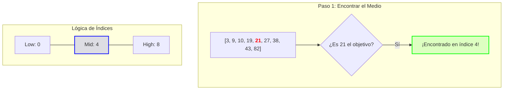

 La **Búsqueda Binaria** es uno de los algoritmos más eficientes y fundamentales en la caja de herramientas de cualquier ingeniero. Basado en el principio de **Divide y Vencerás**, permite localizar un elemento en un conjunto de datos ordenados descartando la mitad de las opciones en cada paso. Su eficiencia es tal que puede encontrar un dato entre un millón en apenas 20 comparaciones. 

Dominar este algoritmo no es solo una habilidad para entrevistas técnicas; es entender cómo escribir código que escale linealmente frente a volúmenes masivos de datos.

## ¿Cómo funciona la Búsqueda Binaria?

El concepto es simple pero poderoso. Imagina que buscas una palabra en un diccionario físico. No empiezas por la primera página; abres el libro por la mitad. Si la palabra que buscas es alfabéticamente menor, descartas toda la mitad derecha y repites el proceso en la izquierda.

Para que esto funcione, existe una precondición absoluta: **El arreglo DEBE estar ordenado**. Sin orden, la lógica de descartar mitades pierde todo su sentido.

## Visualización del Proceso

Imagina que buscamos el número **21** en este arreglo: `[3, 9, 10, 19, 21, 27, 38, 43, 82]`



---

## Implementación "Pro" en Go (1.18+)

Con la introducción de los **Generics** en Go, podemos escribir una implementación universal que funcione para cualquier tipo ordenable (`int`, `string`, `float64`, etc.).

```go
import "cmp"

// BinarySearch retorna el índice del objetivo o -1 si no se encuentra.
func BinarySearch[T cmp.Ordered](nums []T, target T) int {
    low, high := 0, len(nums)-1

    for low <= high {
        // 💡 TIP DE PRODUCCIÓN: Evita el overflow de enteros
        // En lugar de (low + high) / 2, usamos esta fórmula segura:
        mid := low + (high-low)/2 

        if nums[mid] == target {
            return mid
        } else if nums[mid] < target {
            low = mid + 1
        } else {
            high = mid - 1
        }
    }
    return -1
}
```

### El sutil error del "Midpoint Overflow"
Un error clásico que ha afectado incluso a bibliotecas estándar de lenguajes como Java es calcular el medio como `mid = (low + high) / 2`. Si la suma de `low` y `high` supera el límite máximo de un entero de 32 o 64 bits, el resultado será un número negativo o incorrecto. La fórmula `low + (high - low) / 2` es la forma profesional y segura de evitar este bug catastrófico en sistemas de gran escala.

---

## Variaciones Críticas en el Mundo Real

En aplicaciones reales, a menudo no solo queremos saber *si* un elemento existe, sino localizar una posición específica entre duplicados o límites.

### 1. Encontrar la Primera Ocurrencia
Útil cuando tienes múltiples eventos con el mismo timestamp y necesitas el punto exacto donde comenzó una secuencia.

```go
func FindFirst[T cmp.Ordered](nums []T, target T) int {
    low, high := 0, len(nums)-1
    result := -1
    
    for low <= high {
        mid := low + (high-low)/2
        if nums[mid] == target {
            result = mid
            high = mid - 1 // Seguimos buscando a la izquierda
        } else if nums[mid] < target {
            low = mid + 1
        } else {
            high = mid - 1
        }
    }
    return result
}
```

---

## Más allá de los Arreglos: Búsqueda sobre el Resultado

Un uso avanzado y a menudo "invisible" de la búsqueda binaria es aplicarla sobre **funciones monotónicas**. Si tienes un problema donde la respuesta está en un rango conocido (por ejemplo, el precio mínimo para que un negocio sea rentable) y puedes verificar rápidamente si un valor `X` es válido, puedes aplicar búsqueda binaria sobre ese rango de valores en lugar de iterar uno por uno.

Esta técnica es fundamental en algoritmos de optimización y sistemas de toma de decisiones en tiempo real.

## Resumen de Rendimiento

| Característica | Detalle |
| :--- | :--- |
| **Complejidad Temporal** | $O(\log n)$ - El estándar de oro para búsquedas. |
| **Complejidad Espacial** | $O(1)$ - Operación in-place, sin memoria extra. |
| **Requisito Clave** | Acceso Aleatorio ($O(1)$) y Datos Ordenados. |

---

Dominar la Búsqueda Binaria es el primer paso para entender algoritmos más complejos como los Árboles Binarios de Búsqueda y sistemas de indexación en bases de datos. ¿Has tenido que implementar alguna variación personalizada en tus proyectos?
