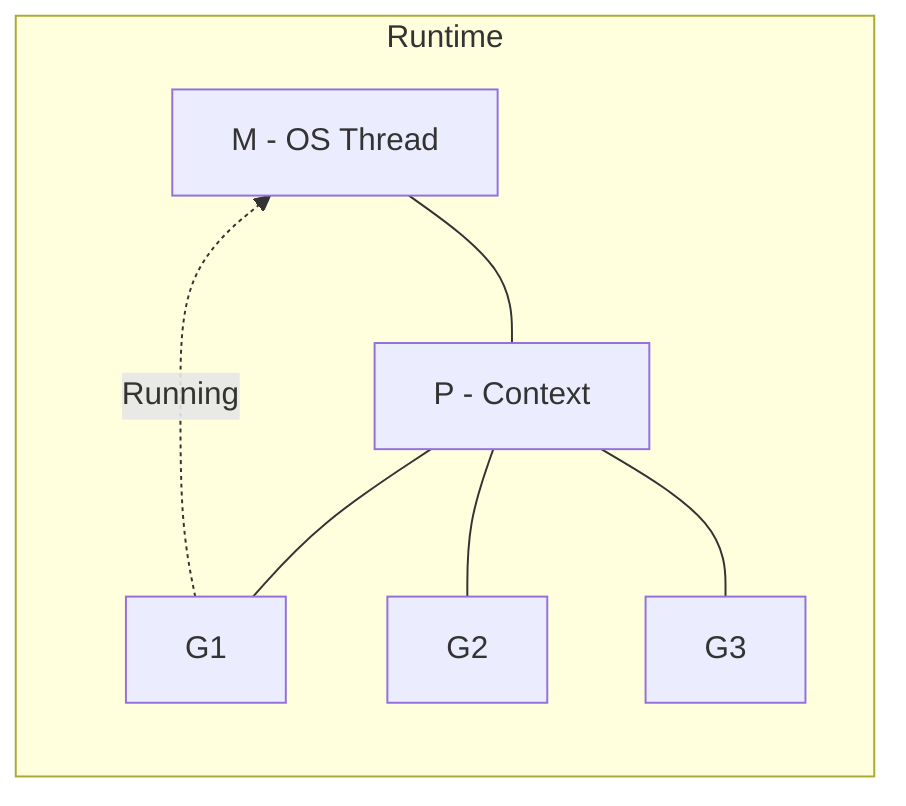

 El **Go Scheduler** es el corazón del runtime de Go. Es el responsable de orquestar la ejecución de miles (o millones) de goroutines sobre un número limitado de hilos del sistema operativo. Gracias a su diseño basado en el modelo **M:N**, Go logra una eficiencia concurrente que muy pocos lenguajes pueden igualar. 

Si alguna vez te has preguntado cómo es posible que Go maneje 100,000 peticiones simultáneas sin colapsar el sistema operativo, la respuesta está en su Scheduler.

## El Modelo M:N

A diferencia de otros lenguajes que mapean cada hilo de la aplicación a un hilo del sistema operativo (modelo 1:1), Go utiliza un modelo **M:N**. Esto significa que mapea $M$ goroutines sobre $N$ hilos del sistema operativo (OS threads). 

Los hilos del SO son "pesados" (consumen ~1-8MB de stack), mientras que una goroutine es extremadamente ligera (~2KB al iniciar). El Scheduler se encarga de que ninguna goroutine monopolice los hilos y de que los cores de tu CPU nunca estén ociosos.

## Los Tres Pilares: M, P y G

Para entender el Scheduler, debemos conocer a sus tres actores principales:

1.  **G (Goroutine):** La unidad mínima de ejecución. Contiene el stack, el instruction pointer y el estado de la goroutine.
2.  **M (Machine/OS Thread):** El hilo real del sistema operativo que ejecuta el código.
3.  **P (Processor):** Un recurso lógico que representa el contexto de ejecución. Para que un hilo (**M**) pueda ejecutar una goroutine (**G**), necesita estar vinculado a un **P**. El número de **P**s está determinado por `GOMAXPROCS` (normalmente el número de cores de tu máquina).

---

## El Secreto de la Eficiencia: Work Stealing

¿Qué pasa si un core termina todas sus tareas mientras otros están saturados? Aquí entra el **Work Stealing** (Robo de Trabajo).

Cada **P** mantiene una cola local de goroutines listas para correr. Si la cola de un **P** se vacía, el Scheduler no permite que ese hilo se quede sin hacer nada; en su lugar, intenta "robar" la mitad de las goroutines de la cola de otro **P**. Esto garantiza que el trabajo se distribuya de forma equitativa y automática entre todos los núcleos disponibles.

## ¿Cómo maneja Go las llamadas bloqueantes?

Uno de los mayores retos de la concurrencia es el bloqueo por I/O (llamadas a base de datos, lectura de archivos, etc.). El Scheduler de Go es inteligente:

- **Syscalls Bloqueantes:** Si una goroutine hace una llamada al sistema que bloqueará el hilo (**M**), el Scheduler desvincula el contexto (**P**) de ese hilo y lo mueve a otro hilo libre o crea uno nuevo. Así, las demás goroutines en la cola de ese **P** pueden seguir ejecutándose sin esperar al I/O.
- **Network Poller:** Para operaciones de red, Go utiliza un componente llamado *Network Poller* que permite que las goroutines "esperen" de forma asíncrona sin bloquear hilos reales del SO.

---

## Preempción: Nadie se queda con el micrófono

Hasta Go 1.14, una goroutine que ejecutaba un bucle infinito de CPU podía bloquear el Scheduler. Hoy en día, el Scheduler de Go es **preemptivo**. Esto significa que si una goroutine lleva demasiado tiempo corriendo (aprox. 10ms) sin ceder el control, el runtime puede interrumpirla forzosamente para dar oportunidad a otras.

## Resumen Técnico

| Característica | Detalle |
| :--- | :--- |
| **Modelo de Ejecución** | M:N (M goroutines sobre N hilos) |
| **Stack Inicial** | ~2KB (crece dinámicamente) |
| **GOMAXPROCS** | Define el paralelismo real (número de Ps) |
| **Estrategia** | Work Stealing + Preempción |

---

Entender el Go Scheduler te permite escribir código concurrente más robusto y diagnosticar problemas de performance complejos. En el próximo post, exploraremos cómo configurar `GOMAXPROCS` para optimizar servicios en la nube.
