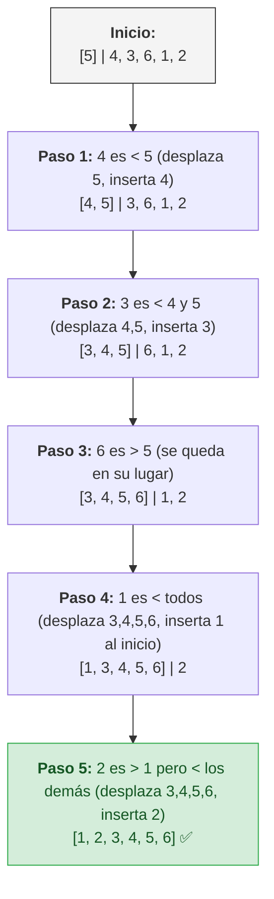

 El **Insertion Sort** (u Ordenamiento por Inserción) es uno de los algoritmos de ordenamiento más intuitivos en ciencias de la computación. Si alguna vez has organizado una mano de cartas de póker o baraja española, ya conoces la lógica maestra detrás de este algoritmo. Funciona tomando los elementos uno por uno y encontrando su posición correcta entre los elementos que ya han sido revisados. 

Si bien a primera vista parece un algoritmo introductorio, guarda secretos fascinantes de eficiencia y arquitectura que lo hacen vital en herramientas y lenguajes computacionales modernos.

## ¿Cómo funciona Insertion Sort?

El concepto central de este método se basa en mantener una **"frontera móvil"**. Si imaginamos nuestro arreglo particionado, el lado izquierdo de esta frontera abstracta se mantiene **perfectamente ordenado en todo momento**, mientras que el lado derecho aloja los elementos pendientes de procesar.

El algoritmo avanza de izquierda a derecha de la siguiente forma: 
Toma el primer elemento pendiente, lo compara con los que ya tiene en el territorio ordenado (retrocediendo paso a paso) y, cuando encuentra valores mayores, los desplaza hacia la derecha para abrir un hueco exacto. Finalmente, se encaja el valor de forma óptima. Esto produce que el escudo de "orden" avance invariablemente una posición hasta conquistar el arreglo final.

## Visualización Paso a Paso

Para comprender este principio de encaje, tomemos el arreglo desordenado `[5, 4, 3, 6, 1, 2]`. Observa detenidamente cómo la barra lateral `|` representa nuestra línea divisoria:



## Implementación Base en Go

La implementación destaca como un excelente recurso didáctico de ciclos anidados controlados bajo condición, que opera bajo el famoso mecanismo de ordenamiento *In-Place* (modificación directa en la memoria local).

```go
func InsertionSort(arr []int) {
    // Si la lista tiene 1 elemento o menos, ya está ordenada
    for i := 1; i < len(arr); i++ {
        key := arr[i] // El elemento en turno a ser insertado
        j := i - 1
        
        // Desplazar elementos en el sub-arreglo consolidado hacia la derecha
        // siempre y cuando sean mayores que la "key"
        for j >= 0 && arr[j] > key {
            arr[j+1] = arr[j]
            j--
        }
        
        // Insertar nuestro pivote en su lugar definitivo
        arr[j+1] = key
    }
}
```

## Análisis Matemático y Rendimiento

El algoritmo exhibe capacidades fuertemente polarizadas dependiendo del panorama de los datos a procesar:

- **Peor Escenario ($O(n^2)$):** Ocurre puntualmente cuando el arreglo se suministra completamente invertido. Cada inserción detona el impacto máximo, obligándonos a desplazar el inventario completo.
- **Mejor Escenario ($O(n)$):** Ocurre cuando proveemos una serie que ya está ordenada por naturaleza. La revisión no requerirá desplazar ni un solo elemento hacia la derecha.
- **Complejidad Espacial ($O(1)$):** Al operar directamente reemplazando celdas preexistentes en los linderos originales, el algoritmo nunca solicita a la computadora crear búferes extraídos de memoria (*in-place sorting*).
- **Tratamiento de Estabilidad:** Es indudablemente **Estable**. Preserva de forma fiel el orden iterativo de objetos que empatan en valor. 

## Casos de Uso Avanzados en Producción

Un ingeniero podría rechazar tempranamente una función $O(n^2)$. Sin embargo, Insertion Sort oculta superpoderes en entornos profesionales puntuales que le ceden coronar frente a opositores como QuickSort:

### 1. El entorno de los datos "Casi Ordenados"
Imagina un sistema de transacciones bancarias ordenado por fecha y hora que funciona a la perfección, pero de pronto, un servidor sufre un ligero "lag" y envía 3 o 4 transacciones con retraso, quedando desordenadas al final de tu inmensa base de datos.
Algoritmos rápidos y famosos como QuickSort empezarían a partir el arreglo desde cero y rearmar todo de nuevo, gastando ciclos inútiles. Sin embargo, Insertion Sort nota instantáneamente que el 99% de la lista ya está acomodada, se limita a tomar esas 3 transacciones desfasadas y las desliza a sus lugares exactos en un parpadeo. Su rendimiento aquí roza un $O(n)$ increíblemente rápido.

### 2. Recepción Dinámica de Datos (Online Algorithm)
Piensa en una tabla de clasificaciones (Leaderboard) de un videojuego multijugador online que recibe puntajes en vivo de distintos jugadores a través de WebSockets. 
No necesitas esperar al final del día para tomar todos los miles de puntajes y aplicarles un proceso de ordenamiento pesado. Gracias a la naturaleza de "frontera" de Insertion Sort, puedes mantener tu tabla siempre ordenada; cada vez que a tu servidor llega un nuevo puntaje en vivo, simplemente lo tomas y lo insertas exactamente en la posición que le corresponde, y sigues escuchando.

## Conclusión

Insertion Sort encapsula un axioma primordial de arquitectura general: la complejidad general teórica de un peor caso no siempre dicta en su totalidad el comportamiento de producción final. Dominar y aprovechar las anomalías físicas de estos métodos más austeros confiere gran sensibilidad técnica para unificar sinergias imbatibles.
