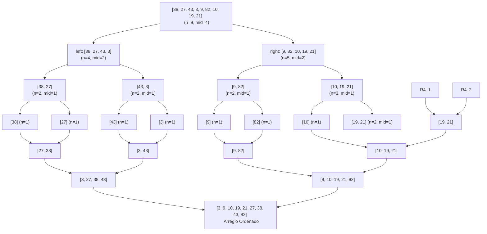
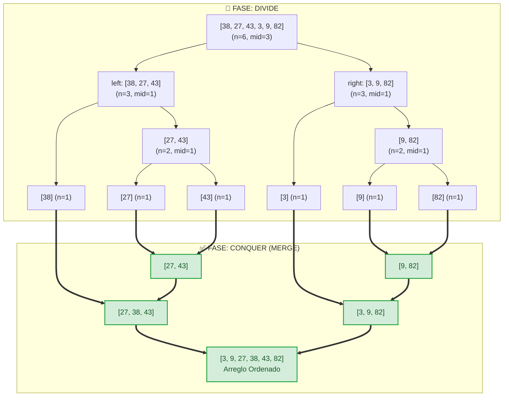

 El algoritmo **Merge Sort** (u Ordenamiento por Mezcla) es uno de los pilares del ordenamiento en ciencias de la computación. Basado matemáticamente en el paradigma **Divide y Vencerás**, se destaca como una herramienta extremadamente poderosa cuando requerimos estabilidad y rendimiento garantizado. 

En este artículo, exploraremos qué lo hace tan especial, cómo implementarlo de manera limpia y una táctica avanzada para optimizar su consumo de memoria en entornos de producción.

## ¿Qué es Merge Sort?

Su funcionamiento se divide en tres fases lógicas:
1. **Divide:** El algoritmo parte el arreglo a la mitad de forma recursiva hasta llegar a elementos individuales, los cuales se consideran ya ordenados.
2. **Conquista (Conquer):** Cada sub-división se resuelve y ordena de forma independiente.
3. **Combina (Merge):** Se unen o "mezclan" las piezas usando algoritmos de dos punteros (*two-pointer technique*), garantizando que las combinaciones resultantes sigan estando ordenadas.

A diferencia del popular *QuickSort*, Merge Sort siempre asegura una complejidad de tiempo de ejecución de **O(n log n)** en cualquier escenario (mejor caso, caso promedio y peor caso). Sin embargo, este rendimiento constante tiene un costo: mayor uso de la memoria RAM.

## Visualización Paso a Paso

Para ver cómo el paradigma de "Divide y Vencerás" trabaja materialmente en un arreglo de ejemplo (n=9), te compartimos este mapa jerárquico del proceso de división.



Una vez reducidos a su mínima expresión matemática (n=1), el algoritmo comienza a ascender combinando (`merge`). Así es como una tabla de estado final interactúa entre un arreglo izquierdo (`L`) y derecho (`R`) utilizando `Two-Pointers`.

### Ejemplo Simplificado (n=6)

Para una comprensión más rápida o si buscas un diagrama más compacto, aquí tienes el proceso gráfico de Merge Sort con un arreglo de 6 elementos (`[38, 27, 43, 3, 9, 82]`):



## Implementación Básica en Go

A continuación, mostramos una implementación muy legible en Go. Este bloque se enfoca en que la lógica algorítmica sea directa y fácil de depurar:

```go
func sortList(unsortedList []int) []int {
    n := len(unsortedList)
    if n <= 1 { return unsortedList }

    midpoint := n / 2
    leftList := sortList(unsortedList[:midpoint])
    rightList := sortList(unsortedList[midpoint:])

    resultList := make([]int, 0, n)
    leftPointer, rightPointer := 0, 0

    for leftPointer < midpoint || rightPointer < n-midpoint {
        if leftPointer == midpoint { // Si se vacía el lado izquierdo
            resultList = append(resultList, rightList[rightPointer])
            rightPointer++
        } else if rightPointer == n-midpoint { // Si se vacía el derecho
            resultList = append(resultList, leftList[leftPointer])
            leftPointer++
        } else if leftList[leftPointer] <= rightList[rightPointer] {
            resultList = append(resultList, leftList[leftPointer])
            leftPointer++
        } else {
            resultList = append(resultList, rightList[rightPointer])
            rightPointer++
        }
    }
    return resultList
}
```

Esta implementación es un excelente **MVP** (Minimum Viable Product). No obstante, un desarrollador experimentado notará rápidamente un área de oportunidad: hay una constante creación de sectores de memoria, o "slices". Crear un nuevo `slice` de tamaño `n` en cada ciclo invoca implícitamente la reserva de memoria dinámica, impactando el rendimiento global por la recolección de basura (*Garbage Collector*).

## Optimización Clave: El Patrón de Búfer Compartido

Si se requiere una versión optimizada, destinada a librerías estándar o plataformas de alta escala, la mejor solución es el **Patrón de Búfer Compartido** (*Shared Buffer Pattern*).

Este enfoque se basa en asignar un único arreglo `temp` con capacidad para `N` elementos, antes de comenzar el proceso de recursividad. Ese `temp` sirve como fotocopiadora compartida. Las funciones solo leen desde ahí, reescribiendo la posición final directamente sobre los punteros iniciales de forma económica.

Observemos este modelo optimizado:

```go
func SortList(arr []int) []int {
    if len(arr) <= 1 { return arr }
    
    // Un solo buffer auxiliar compartido para toda la ejecución
    temp := make([]int, len(arr))
    mergeSort(arr, temp, 0, len(arr)-1)
    return arr
}

func mergeSort(arr, temp []int, left, right int) {
    if left < right {
        mid := left + (right-left)/2
        
        // Fases de División
        mergeSort(arr, temp, left, mid)
        mergeSort(arr, temp, mid+1, right)
        
        // Fase de Combinación (Mezcla)
        merge(arr, temp, left, mid, right)
    }
}

func merge(arr, temp []int, left, mid, right int) {
    // 1. Respaldar variables de trabajo en el búfer
    for i := left; i <= right; i++ { temp[i] = arr[i] }

    i, j, k := left, mid+1, left
    
    // 2. Mezcla Directa apuntando al arreglo real
    for i <= mid && j <= right {
        if temp[i] <= temp[j] {
            arr[k] = temp[i]
            i++
        } else {
            arr[k] = temp[j]
            j++
        }
        k++
    }
    
    // 3. Empujar elementos restantes
    for i <= mid {
        arr[k] = temp[i]
        i++; k++
    }
}
```

Gracias a esto, reducimos la memoria a **O(N) estrictamente**; sin importar cuántas uniones o subdivisiones ocurran, jamás excederemos el tamaño original del búfer. Esta técnica demuestra dominio sobre las estructuras de datos nativas y el manejo de recolección de basura.

## Conclusión

El uso de *Merge Sort* brilla por su solidez matemática. Si bien el alto uso de memoria frecuentemente inclina a los programadores hacia QuickSort, optimizaciones como el *Shared Buffer* lo devuelven a lugares protagónicos, especialmente en casos como la gestión subyacente del ordenamiento constante e ininterrumpido a gran escala. Además, para las listas enlazadas, es la primera opción indisputable, puesto que el acceso secuencial es el núcleo fuerte de *Merge Sort*.
