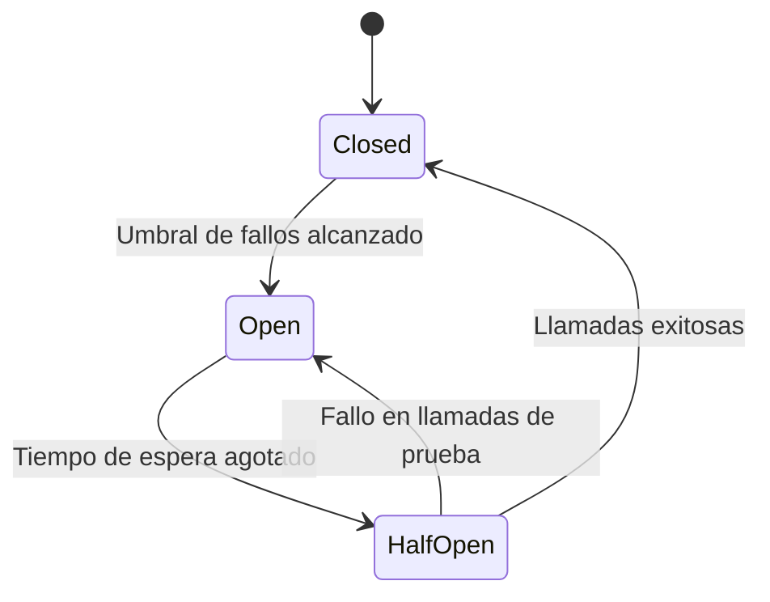

 En un sistema distribuido, el fallo no es una posibilidad, es una certeza. La diferencia entre una aplicación mediocre y una de clase mundial es cómo maneja esos fallos. Aplicando patrones como **Circuit Breaker**, **Retry** y **Fallback**, podemos evitar que un pequeño error en un microservicio tumbe todo el ecosistema. 

Construir sistemas resilientes significa aceptar que las dependencias externas (bases de datos, APIs de terceros, microservicios) fallarán tarde o temprano. Aquí te explico los tres pilares fundamentales para proteger tu arquitectura.

---

## 1. Retry Pattern: La Perseverancia Inteligente

El patrón **Retry** vuelve a intentar una operación que ha fallado bajo el supuesto de que el error es **transitorio** (una pérdida momentánea de red o un pico de tráfico).

### Reglas de Oro para un Retry Seguro:
- **No reintentes errores fatales:** Si recibes un `400 Bad Request` o un `401 Unauthorized`, reintentar no servirá de nada. Solo reintenta errores `5xx` o de conexión.
- **Backoff Exponencial:** No golpees el servicio caído de inmediato. Espera progresivamente más entre intentos (1s, 2s, 4s, 8s).
- **Jitter (Aleatoriedad):** Agrega un pequeño factor aleatorio al tiempo de espera. Esto evita el efecto "Thundering Herd", donde miles de clientes reintentan exactamente al mismo tiempo, rematando al servidor que intentaba recuperarse.

---

## 2. Circuit Breaker: El Interruptor de Seguridad

Inspirado en los sistemas eléctricos, el **Circuit Breaker** detecta cuando un servicio está fallando sistemáticamente y "abre el circuito" para detener todas las llamadas hacia él.

### Los Tres Estados:
- **Closed (Cerrado):** Todo funciona normal. Las llamadas pasan y el sistema cuenta los errores.
- **Open (Abierto):** Se alcanzó un umbral de errores (ej. 50% de fallos). El sistema rechaza las llamadas de inmediato (*fail-fast*) para dar respiro al servicio afectado.
- **Half-Open (Semi-abierto):** Tras un tiempo de espera, se permiten unas pocas llamadas de prueba. Si tienen éxito, el circuito se cierra; si fallan, vuelve a abrirse.

---

## 3. Fallback Pattern: El Plan B

¿Qué haces cuando el Retry falló y el Circuit Breaker está abierto? Aquí entra el **Fallback**. Es la respuesta alternativa que mantendrá la experiencia del usuario a flote.

### Ejemplos de Fallback en el Mundo Real:
- **Cache:** Si el servicio de "Productos Recomendados" no responde, muestra los productos más vendidos de la última hora guardados en caché.
- **Valores Estáticos:** Si el microservicio de "Tasas de Cambio" falla, usa la última tasa conocida o un valor por defecto.
- **Degradación de Interfaz:** Si el servicio de "Comentarios" no carga, simplemente no muestres la sección de comentarios en lugar de romper toda la página del producto.

---

## Resumen de Decisiones

| Patrón | Cuándo usarlo | Objetivo Principal |
| :--- | :--- | :--- |
| **Retry** | Errores transitorios de red. | Recuperación automática inmediata. |
| **Circuit Breaker** | Errores persistentes o servicio caído. | Evitar fallos en cascada y proteger recursos. |
| **Fallback** | Cuando el servicio principal falla. | Mantener la disponibilidad y experiencia de usuario. |

---

## Conclusión

La resiliencia no se trata de evitar el error, sino de convivir con él de forma elegante. Al combinar estos tres patrones, tus microservicios se vuelven mucho más robustos y capaces de sobrevivir en la "selva" de los entornos distribuidos modernos.

¿Cuál de estos patrones te ha salvado la vida en producción?
