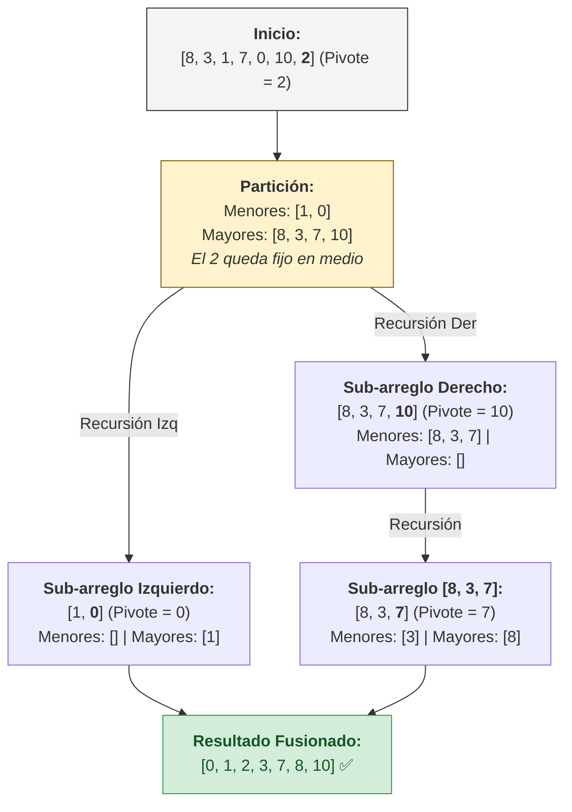

 El **Quick Sort** (u Ordenamiento Rápido) es, en la mayoría de los escenarios prácticos, el algoritmo de ordenamiento más veloz que existe. Creado por Tony Hoare en 1959, es el estándar de la industria y la fuerza motriz detrás de la función sort por defecto de casi cualquier lenguaje de programación moderno. 

Si Insertion Sort era excelente para organizar tu mano de cartas una por una, Quick Sort brilla cuando tienes cajas repletas de miles de datos y necesitas catalogarlos todos a la velocidad de la luz.

## ¿Cómo funciona Quick Sort?

El secreto de Quick Sort radica en su famosa estrategia de **"Divide y Vencerás"**. En lugar de intentar ordenar todo el arreglo de golpe, lo rompe en problemas mucho más pequeños.

El proceso es el siguiente:
1. **Elegir un "Pivote":** Se toma un elemento del arreglo (puede ser el primero, el último o uno al azar). Este elemento servirá como nuestra referencia maestra.
2. **Partición:** Reorganizamos todo el arreglo para que **todos** los números menores al pivote queden a su izquierda, y **todos** los números mayores queden a su derecha. En este punto, no importa si los lados no están completamente ordenados; lo que importa es que el pivote ya está en su posición final, exacta y permanente en el universo.
3. **Recursividad:** Ahora tenemos dos sub-arreglos (el de los menores y el de los mayores). Aplicamos mágicamente Quick Sort de nuevo a cada uno de ellos.

Este ciclo de particiones se repite hasta que los sub-arreglos tienen 0 o 1 elementos, momento en el cual el arreglo entero queda ordenado.

## Visualización Paso a Paso

Para ver cómo funciona la partición y la recursividad, ordenemos el arreglo `[8, 3, 1, 7, 0, 10, 2]`. 
Tomaremos siempre el **último elemento** como nuestro pivote.



Al igual que en un árbol de decisiones, el problema original se atomiza tan rápido que la computadora resuelve secciones diminutas sin esfuerzo.

## Implementación Base en Go

Aquí tienes la implementación clásica. Observa cómo la lógica principal casi parece pseudocódigo gracias a su simpleza, delegando el peso pesado a la función de partición.

```go
// QuickSort principal (orquesta la recursividad)
func QuickSort(arr []int, low, high int) {
	if low < high {
		// Encontramos el índice de nuestro pivote ya acomodado
		pivotIndex := partition(arr, low, high)

		// Ordenamos el lado izquierdo del pivote
		QuickSort(arr, low, pivotIndex-1)
		// Ordenamos el lado derecho del pivote
		QuickSort(arr, pivotIndex+1, high)
	}
}

// Función encargada de agrupar mayores y menores alrededor del pivote
func partition(arr []int, low, high int) int {
	pivot := arr[high] // Tomamos el último elemento como pivote
	i := low - 1       // i nos ayudará a llevar cuenta de dónde poner a los menores

	for j := low; j < high; j++ {
		// Si el elemento actual es menor que el pivote
		if arr[j] < pivot {
			i++
			// Lo empujamos hacia la la zona de "menores" (izquierda)
			arr[i], arr[j] = arr[j], arr[i] 
		}
	}
	
	// Colocamos el pivote justo en medio de los menores y mayores
	arr[i+1], arr[high] = arr[high], arr[i+1]
	
	return i + 1 // Retornamos la posición final del pivote
}
```

## Análisis Matemático y Rendimiento

El rey de los algoritmos tiene métricas asombrosas en la práctica, aunque esconde un terrible secreto si tienes mala suerte:

- **Escenario Promedio y Mejor Caso ($O(n \log n)$):** Ocurre la inmensa mayoría del tiempo. Debido a que rompe el problema a la mitad repetidamente (el $\log n$), es capaz de digerir millones de elementos brutalmente rápido.
- **Peor Escenario ($O(n^2)$):** Ocurre si *siempre* elegimos el peor pivote posible (por ejemplo, tomar el número más grande en un arreglo que ya está ordenado). Termina degradándose y comportándose tan mal como un Insertion Sort en su peor día.
- **Complejidad Espacial ($O(\log n)$ a $O(n)$):** Como opera en su mismo lugar (*In-Place*), requiere muy poca memoria extra, sólo la que gasta en el "Call Stack" de los llamados recursivos.
- **Tratamiento de Estabilidad:** Es un algoritmo **Inestable**. Si tenemos dos objetos empatados y tienen el mismo valor, Quick Sort podría alterar el orden en que se encontraban originalmente.

## Casos de Uso en Producción

Quick Sort rara vez se usa para conjuntos pequeños de datos o bases de datos que reciben elementos vivos uno por uno (donde preferíamos *Insertion Sort*), pero es el indiscutible soberano de los datos masivos estáticos:

### 1. La Amigable Caché del Procesador
Si bien algoritmos como *Heap Sort* o *Merge Sort* tienen una complejidad garantizada perfecta sin escenarios $O(n^2)$, Quick Sort les gana en la vida real. ¿La razón? Se lleva extremadamente bien con la **localidad de caché (Cache Locality)** del hardware. Va leyendo el arreglo secuencialmente saltando muy poco, permitiendo a la memoria L1 de tu CPU procesar las operaciones sin interrupciones.

### 2. Tablas y Big Data Recursivos
Imagina una base de datos analítica con millones de transacciones históricas exportadas a un archivo para generar un reporte que requiere ser ordenado del mayor volumen económico al menor. Usar *Merge Sort* implicaría gastar el doble de memoria RAM simplemente para crear los arreglos clonados. *Quick Sort* ataca el arreglo en crudo allí mismo, consumiendo fracciones minúsculas de memoria y terminando el trabajo gracias a su partición en milisegundos.

## Conclusión

El poder de Quick Sort reside en su caos inicial. En lugar de ser cauteloso, lanza a los números fuertemente a sus lados correspondientes y confía en el poder indomable de la recursividad. Es la herramienta por excelencia para demostrar que fragmentar un problema enorme en problemas pequeños siempre será una de las mejores tácticas en la ingeniería de software.
