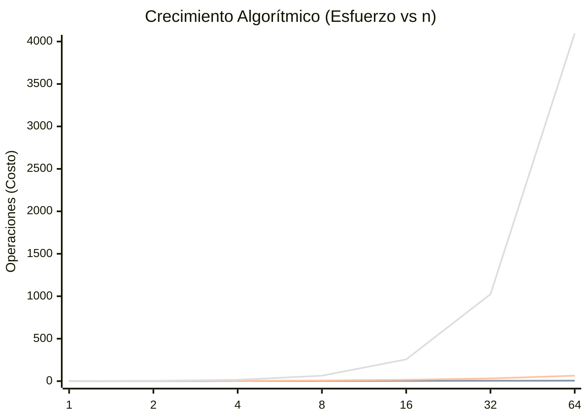

¿Alguna vez has escrito código que vuela con 10 registros en tu máquina local, pero hace colapsar todo el sistema cuando procesa 10,000 en el servidor? Medir la calidad de nuestros algoritmos usando milisegundos es una trampa mortal de desarrollo.

 La complejidad temporal es la disciplina que nos permite medir el crecimiento del costo computacional (operaciones) a medida que aumenta el tamaño de la entrada (`n`). Utilizando la notación Big O, podemos predecir con exactitud la escalabilidad técnica y el consumo de recursos independientemente del hardware o entorno de ejecución donde esté montado el sistema. 

## El Problema: Milisegundos vs. Operaciones

Es común pensar que si una función tarda solo 10ms en nuestra laptop, es el diseño perfecto. Sin embargo, el tiempo de ejecución es caótico y está viciado por variables fuera de nuestro control: la potencia del CPU en el momento, el recolector de basura de tu lenguaje o la carga general del sistema.

Si llevamos un código poco óptimo (digamos cuadradito `O(n^2)`) a un ecosistema con millones de transacciones por segundo, los milisegundos inofensivos de tu computadora de escritorio se transformarán en horas de embotellamientos, picos estratosféricos en tus gastos de la nube e inclusive caídas abruptas de servidores por *Out of Memory*. 

## Fundamentos de la Notación Big O (`O`)

El análisis asintótico a través de la notación **Big O** nos permite ignorar distracciones y enfocarnos puramente en el incremento del algoritmo a largo plazo. Aplicamos entonces 3 reglas de oro:

### 1. Ignorar las Constantes
Si un algoritmo emplea 2 operaciones por cada elemento para resolverse (`2n`) y otro emplea solo 1 operación `(n)`, a largo plazo **ambos** crecerán al mismo ritmo de forma lineal. Big O se interesa únicamente en la tendencia de esa tasa de crecimiento; el 2 constante es irrelevante porque en escalas masivas es diminuto (`O(n)`).

### 2. El Dominio del Mayor Término
Supongamos que tu función completa `n^2 + n + 10` operaciones. El impacto de los números solitarios y de `n` se vuelven invisibles comparados al daño masivo que provoca `n^2` cuando la cantidad de entrada `n` equivale a `1,000,000`. En consecuencia, ese pedazo de código siempre será tratado como si fuera `O(n^2)`.

### 3. Asumir el Peor de los Casos
Al diseñar un puente de ingeniería, no asumes que transitarán autos ligeros en un día asoleado; lo construyes para resistir a docenas de camiones comerciales en medio de un huracán. Diseñar de manera predeterminada para soportar el entorno más hostil e imputs complejos garantiza que cualquier otro escenario menor será irrelevante.

## La Jerarquía del Rendimiento y Complejidad

Aquí observamos cómo progresan los tipos de complejidad cuando la cantidad de datos (`n`) escala exponencialmente:

- **Constante `O(1)`:** Rendimiento óptimo sin importar si le entregamos 5 registros o 5 billones de transacciones, todo el procesamiento dura lo mismo (ej: buscar en un Hash Map).
- **Logarítmica `O(\log n)`:** El costo crece absurdamente lento en proporción al número de registros (ej. dividir sistemáticamente todo a la mitad).
- **Lineal `O(n)`:** Todo crece uniformemente. Dos usuarios ocupan lo que toman dos usuarios.
- **Linearítmica `O(n \log n)`:** Generalmente es el margen estandar de los algoritmos de ordenamiento altamente eficientes (como Quick Sort o Merge Sort).
- **Cuadrática `O(n^2)`:** Peligroso si se permite en la naturaleza, como lo son bucles anidados sobreciendo todas las combinaciones que estallan con facilidad.

## Aplicación Práctica y Trade-Offs

Pensar en Time Complexity no te dicta escribir cada byte de código para que sea obligatoriamente un `O(\log n)`. Se trata de ser consciente de los sacrificios técnicos (Trade-Offs).

Por ejemplo, implementar código complejo de tipo Cuadrático puede estar completamente justificado en empresas y prototipos MVP en donde el Time-to-Market manda y el arreglo a procesar siempre será un subconjunto mínimo (ej: categorizar los 12 meses del año). Entregar la lógica clara y barata triunfa por encima de semanas construyendo el código más eficiente existente. 

Por otra parte, tener un algoritmo de complejidad Temporal inmediata puede requerir almacenar muchísimos datos previos temporales en Caché (Memoria Cuadrática o Espacial Elevada). Resultando en OOM, matando procesos de Cloud y desacomodando por completo el hardware. Se debe nivelar siempre.

## Conclusión

Predecir y calcular mentalmente los estragos y colisiones que nuestra arquitectura tendrá a largo plazo, define el límite entre un programador junior y un ingeniero de software senior.
- Analiza y calcula basándote en el peor escenario posible.
- Simplifica variables irrelevantes de velocidad, concéntrate de lleno en elementos predominantes del patrón de crecimiento.
- Recuerda que la balanza está sostenida en dos placas: Time Complexity y Space Complexity. Si vacías por completo un lado, puede que el otro peso destruya los costos de la plataforma.

Y tú, ¿Alguna vez tuviste que tirar a la basura una implementación completa luego de darte cuenta de que su consumo asintótico lo volvía un cuello de botella terrible? Te leo en los comentarios.
